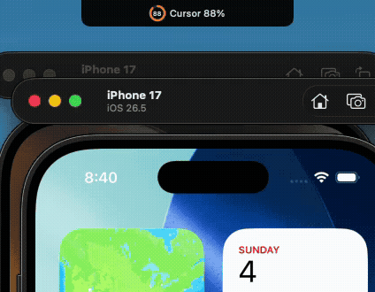

# NotchMeter

**Your AI subscription burn, in the MacBook notch.**

A Dynamic-Island-style overlay that shows how much of your AI plan quotas you've used — at a glance, without opening a dashboard.



- **Collapsed**: a pill fused into the notch showing your most-consumed provider (`Cursor 88%`).
- **Hover**: expands into a panel with every provider — per-window usage bars, reset countdowns, plan badges, credit balances.
- Polls every 60s. Runs as a background agent (no Dock icon).

Requires macOS 14+ (Sonoma). No dependencies, no Xcode project — just SwiftPM.

## Install

Download `NotchMeter.zip` from the [latest release](../../releases/latest), unzip, and move `NotchMeter.app` to `/Applications`.

The release build is ad-hoc signed, so on first launch either right-click → **Open**, or run:

```sh
xattr -d com.apple.quarantine /Applications/NotchMeter.app
```

Quit it with `killall NotchMeter` (or Activity Monitor) — there's deliberately no menu item yet.

## Supported providers

| Provider | Credential source | Endpoint |
|---|---|---|
| Claude (Pro/Max/Code) | `Claude Code-credentials` entry in macOS Keychain (created by Claude Code) | `api.anthropic.com/api/oauth/usage` → 5h + 7d windows |
| ChatGPT (Plus/Pro via Codex CLI) | `~/.codex/auth.json` | `chatgpt.com/backend-api/wham/usage` → primary + secondary windows, credits |
| Cursor | session token in Cursor's `state.vscdb` | `cursor.com/api/usage-summary` → billing-cycle usage |

All endpoints are the unofficial/internal ones the providers' own apps and dashboards use — same approach as opencode-quota and openusage. They can break without notice; the app degrades to an error row per provider rather than crashing.

No credentials exist? NotchMeter shows demo data so the UI is always previewable.

## Privacy

NotchMeter reads the OAuth/session credentials your AI tools already store locally and calls only the providers' own usage endpoints. Nothing is sent anywhere else — no analytics, no telemetry, no third-party servers.

## Build & run

```sh
swift build
swift run NotchMeter          # real data from whatever AI tools you're logged into
swift run NotchMeter --demo   # forced demo data
```

Package a signed `.app` bundle:

```sh
make bundle                   # release build → NotchMeter.app (ad-hoc signed)
make install                  # copy to /Applications
```

## Roadmap

- GitHub Copilot, Gemini, Grok providers
- macOS notifications at 80%/95% thresholds
- OAuth token refresh for expired Claude/Codex sessions
- Burn-rate forecast ("at this pace you hit the limit ~3pm")
- LaunchAgent autostart / launch-at-login

Contributions welcome — especially new providers. A provider is a small struct conforming to `UsageProvider` (see `Sources/NotchMeter/Providers.swift`).

## License

[MIT](LICENSE)
